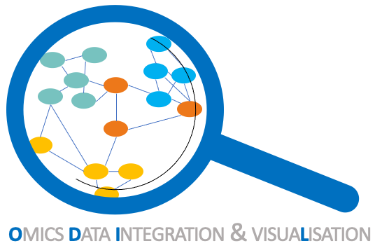

 

## Qui sommes-nous ?

La cellule de bioinformatique ODIL (Omics Data Integration & visuaLisation) a pour but d'accompagner les membres du BRIC dans leur projet impliquant des expertises en bioinformatique suivant la stratégie présentée au travers de nos missions décrites dans la section éponyme.

_Comité exécutif_
-	Responsable Scientifique : Elodie Darbo
-	Cyril Dourthe

_Comité Utilisateurs·trices expert·e·s_
-	Samuel Amintas
-	Anne-Aurélie Raymond
-	Audrey Gros
-	Jessica Massière

[Organigramme et logigramme](docs/presentation_gramme.md)

## Nos missions

-	Consolider le lien avec l' axe Santé-Numérique du Laboratoire Bordelais de Recherche en Informatique (LaBRI) par le co-encadrement de Master/Doctorant·e/Post-Doc et par l'organisation de rencontres LaBRIC entre les deux unités. Voir: <a href="docs/LaBRIC.md">Qu'est-ce que le LaBRIC ?</a>

-	Encadrement de stagiaires en bioinformatique (M1/M2) et d’ingénieur·e·s (IE) (<a href="docs/encadrement.md">Encadrements</a>)

-	Accompagnement pour la réponse à des appels à projets

-	Développement d’outils interfacés et mise à disposition des chercheurs pour l’exploration et la visualisation de résultats

-	Mise en place progressive d’une base de données interne au BRIC

-	Formation à l’utilisation d’outils

-	Faire remonter les besoins des équipes pour aider à l’amélioration des outils (ex : ajout de fonctionnalités) ou pour la création de nouveaux outils grâce à des réunions régulières entre utilisteurs et concepteurs.

## Bac à sable

Nous mettons à disposition aux membres du BRIC une <a href="https://bricbordeaux.sharepoint.com/:f:/s/Bioinformatique-ODILE/EmxWqC8e19hAnHp3BQSGqKEBFhAwiiDrJs9gmGC_MIia8g?e=80eBpz">boite à idées</a> dans laquelle vous pourrez y déposer vos idées concernant la visualisation de vos résultats. <a href="https://bricbordeaux.sharepoint.com/:w:/s/Bioinformatique-ODILE/Ea2afKky_QdJjeY8pDzz2rwBYhwmXL-2KREUOgOLUKN98A?e=VdcPhy"> Un modèle</a> y est d'ailleurs disponible. 

L'idée est de pouvoir identifier au sein de notre unité les compétences déjà présentes et de faciliter leurs échanges et transferts.

## Recensement des compétences

Nous mettons à disposition [un tableur](https://bricbordeaux.sharepoint.com/:x:/s/Bioinformatique-ODILE/Ee_IXmXP3r1LlPqMqxGpE40BX_I_AYMhtoLguku24_Qj5g?e=IrDkgL) où chacun est libre de s'y ajouter pour y faire apparaitre des compétences de tout niveau en bioinformatique. Cela peut concerner à la fois la maitrise de bases données ou d'outils en ligne, la montée en compétence d'analyse de données spécifiques (RNA-seq, CHIP-seq, single cell, protéomique spatiale etc.).

## Nous joindre

Contact : elodie.darbo@u-bordeaux.fr
